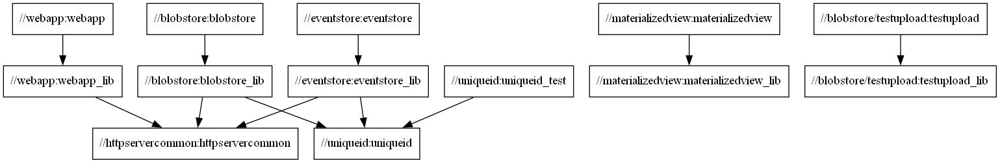
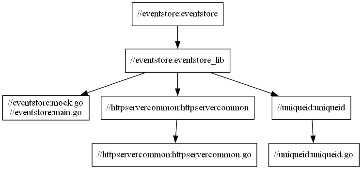
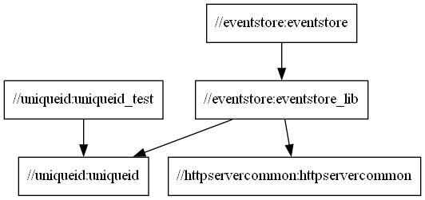

# POC Bazel Monorepo

[](https://github.com/antonhornquist/monorepo1/actions?query=branch%3Amain)

## Purpose

Establish a small monorepo containing disparate services written in Go built and tested using Bazel to evaluate
- Bazel as a build tool for a monorepo containing a variety of services and libraries.
- sparse checkout of source code from the repo based on the Bazel build graph.
- incremental Bazel builds in a simple CI pipeline

## Requirements

### Bazel

Bazel is used to build code and run tests. There are many ways to [install Bazel](https://bazel.build/install). The recommended way on Ubuntu Linux, macOS and Windows is to install [Bazelisk](https://github.com/bazelbuild/bazelisk) "A user-friendly launcher for Bazel". A Bazelisk executable renamed to "bazel.exe" running on Windows 10 was used when the code in this repo was written. It should be added to the $PATH or equivalent.

### Gazelle for WORKSPACE and BUILD file code generation (optional)

[Gazelle](https://github.com/bazelbuild/bazel-gazelle) is a build file generator for Bazel projects. It can create new BUILD files for a project that follows language conventions, and it can update existing build files to include new sources, dependencies, and options. It natively supports Go and may be extended to support new languages. 

Gazelle was evaluated when the code in this repo was written. BUILD files were initially written from scratch. Then Gazelle was used to create BUILD files from the Go source code and to populate the WORKSPACE file with references to dependencies in external repos.

Gazelle may be run by Bazel using the gazelle rule, or it may be installed and run as a command line tool. Running gazelle by a Bazel rule is described here: [Running Gazelle with Bazel](https://github.com/bazelbuild/bazel-gazelle#running-gazelle-with-bazel). Running gazelle command line tool is described here: [Running Gazelle with Go](https://github.com/bazelbuild/bazel-gazelle#running-gazelle-with-go).

Running gazelle using a Bazel rule did not work on Windows when used with Go source code that referred to dependencies in external repositories. The gazelle command line program supported this and was thus used when writing the code. If the command line gazelle program is used it should be added to the $PATH or equivalent.

### GraphViz/Dot to support build visualisation (optional)

To convert the text based Bazel build graph query output to PNG visualizations the dot tool in the open source [GraphViz](https://graphviz.org/) is required. It should be added to the $PATH or equivalent for running examples below.

## Building source code and running tests

A project should always be able to run `bazel build //...` and `bazel test //...` successfully on its stable branch. This will build all targets and dependencies required and run all tests.

A specific Bazel target and its [direct and transient dependencies](https://bazel.build/concepts/dependencies) are built using `bazel build //path/to:build_target`. Similarly, a specific test is run using `bazel test //path/to:test_target`. Running a test implies also building all its direct and transient dependencies.

Regardless of how it is invoked Bazel will only rebuild targets and tests not already cached. Only changed targets and dependencies are rebuilt. This speeds up builds considerably and is a base requirement for growing the monorepo which providing quick build and test feedback time.

### Building all (updated) targets

`$ bazel build //...`

This replaces the use of `go build` for Go source code.

### Running all (updated) tests

`$ bazel test //...`

This replaces the use of `go test` for tests written in Go source code.

### Building a specific target or running a specific test

`$ bazel build //webapp:webapp` (`$ bazel build //webapp` can also be used)

`$ bazel test //uniqueid:uniqueid_test`

### Running a specific binary

`$ bazel run //webapp:webapp` (same as `$ bazel run //webapp`)

### Platform specific considerations and cross-compilation

Bazel and Go (using `rules_go`) supports cross-compilation of source code, see [How do I cross-compile?](https://github.com/bazelbuild/rules_go#how-do-i-cross-compile) in the `rules_go` documentation.

If `--platforms` option is not supplied the platform on which Bazel is run takes precedence. During evaluation, it became apparent how build results diverged between a local Windows workstation and Linux based Github Actions pipeline. Build results of simple Golang builds diverge in terms of the binaries produced. It should also be noted that low level external `Cgo` dependencies have very different dependency graphs between platforms and may cause a Baezl build that passes on Windows to break on Linux. Specifying a common platform (ie. `bazel build --platforms=@io_bazel_rules_go//go/toolchain:linux_amd64 //...`) makes compilation more deterministic.

## How the WORKSPACE file was defined

The root level WORKSPACE file is annotated with comments describing the reason behind statements defined in the file. All statements except the `go_repository()` statements were defined manually. The `go_repository()` statements were generated using the `update-repos` option in `gazelle` (see below).

## How Bazel dependencies were defined based on the Go source code

The Gazelle build file generator was used to generate BUILD files from Go source code and to update the root level WORKSPACE file with external dependencies.

The first argument to Gazelle is one of the commands `update`, `fix` and `update-repos`. If no command is specified, `update` is assumed.

`update` - Scans sources files, then generates and updates build files.
`fix` - Same as the update command, but it also fixes deprecated usage of rules.
`update-repos` - Adds and updates repository rules in the WORKSPACE file.

See [Gazelle usage](https://github.com/bazelbuild/bazel-gazelle#id9) for details.

Practically, BUILD files for Go code were generated and regenerated using the `gazelle -go_prefix github.com/antonhornquist/monorepo1` statement. As long as code follows Go programming language idioms Gazelle gracefully produces well structured BUILD files with `go_libary` targets dependency mapped within the repo, and `go_binary` and `go_test` targets for source in package main and any file named `*_test.go`. It is debatable whether the BUILD files generated by Gazelle needs to be maintained in version control at all.

External dependencies require invocation of the `update-repos` command which updates the root level WORKSPACE file with external go dependencies.

This command can be invoked by import path:

`gazelle update-repos example.com/repo1 example.com/repo2`

It can also be invoked by scanning a go.mod file:

`gazelle update-repos -from_file=file`

For the monorepo go.mod file alternative was used as input to the `gazelle update-repos` command, ie.:

`gazelle update-repos -from_file=nativeapp/go.mod`

It should be noted that while Gazelle can use go.mod files to generate its external go repository dependencies, these go.mod files are discarded in the actual build. The WORKSPACE file and BUILD files act as the go.mod and go.sum files in a regular go build. In order for external Gazelle generated go repositories to build correctly the root folder has to be defined as a package. An empty BUILD file in the root will satisfy this requirement. If the root folder is not explicitly defined as a package the following error is thrown when `bazel build [...]` is invoked:

`Error in path: Unable to load package for //:WORKSPACE: BUILD file not found in any of the following directories. Add a BUILD file to a directory to mark it as a package.`

## Continuous Integration

A [very simple pipeline](.github/workflows/build-and-test.yaml) that runs two jobs - Build and Run Tests - sequentially in a Github Workflow has been defined. It uses a Bazel cache.

Following above assertion that "[a] project should always be able to run `bazel build //...` and `bazel test //...` successfully on its stable branch" the Github CI workflow is very simple. It defines two jobs to run sequentially, the first one validates no compilation errors are occuring (`bazel build //...`) and the second one validates no tests are broken (`bazel test //...`). In practice, due to the use of a Bazel cache the continuous integration build only rebuilds what's necessary, depending on recent code changes.

## Visualizing the build

Bazel query command and GraphViz can be used to visualize the build graph.

The `start [filename.png]` part of the following commands only works on Windows. It is used to automatically display the generated visualization. Apart from that, all commands should work on GNU Linux and macOS as long as requirements above are met.

```
$ bazel query "//..."
//blobstore:blobstore
//blobstore:blobstore_lib
//blobstore/testupload:testupload
//blobstore/testupload:testupload_lib
//eventstore:eventstore
//eventstore:eventstore_lib
//httpservercommon:httpservercommon
//materializedview:materializedview
//materializedview:materializedview_lib
//nativeapp:nativeapp
//nativeapp:nativeapp_lib
//uniqueid:uniqueid
//uniqueid:uniqueid_test
//webapp:webapp
//webapp:webapp_lib
```

```
$ bazel query "//..." --output graph
digraph mygraph {
  node [shape=box];
  "//nativeapp:nativeapp"
  "//nativeapp:nativeapp" -> "//nativeapp:nativeapp_lib"
  "//blobstore:blobstore"
  "//blobstore:blobstore" -> "//blobstore:blobstore_lib"
  "//eventstore:eventstore"
  "//eventstore:eventstore" -> "//eventstore:eventstore_lib"
  "//blobstore/testupload:testupload"
  "//blobstore/testupload:testupload" -> "//blobstore/testupload:testupload_lib"
  "//eventstore:eventstore_lib"
  "//eventstore:eventstore_lib" -> "//httpservercommon:httpservercommon"
  "//eventstore:eventstore_lib" -> "//uniqueid:uniqueid"
  "//blobstore:blobstore_lib"
  "//blobstore:blobstore_lib" -> "//httpservercommon:httpservercommon"
  "//webapp:webapp"
  "//webapp:webapp" -> "//webapp:webapp_lib"
  "//blobstore/testupload:testupload_lib"
  "//materializedview:materializedview"
  "//materializedview:materializedview" -> "//materializedview:materializedview_lib"
  "//materializedview:materializedview_lib"
  "//nativeapp:nativeapp_lib"
  "//uniqueid:uniqueid_test"
  "//uniqueid:uniqueid_test" -> "//uniqueid:uniqueid"
  "//uniqueid:uniqueid"
  "//webapp:webapp_lib"
  "//webapp:webapp_lib" -> "//httpservercommon:httpservercommon"
  "//httpservercommon:httpservercommon"
}
```

Using GraphViz the textual directed acyclical graph representation can be visualized as written to a PNG file.

```
$ bazel query "//..." --output graph | dot -Tpng > graph.png
```

On Windows a one-liner can visualize different graph based Bazel queries.

```
$ bazel query "//..." --output graph | dot -Tpng > graph.png && start graph.png
```

The resulting visualization of the invocation above is a graph of all targets and their dependencies:



All dependencies including external go dependencies can be included in the visualization. The result is an accurate depiction of dependencies but also a very large graph.

```
$ bazel query --noimplicit_deps "deps(//...)" --output graph | dot -Tpng > graph.png && start graph.png
```

All dependencies including external go dependencies and implicit dependencies can be included in the visualization. This makes the graph even larger.

```
$ bazel query --noimplicit_deps "deps(//...)" --output graph | dot -Tpng > graph.png && start graph.png
```

## Build aware sparse checkouts

Scenario: A developer wants to work with the eventstore target. What subset of the monorepo is required to build the target?

Query for direct and transient dependencies, ie. to the eventstore target.

```
$ bazel query "deps(//eventstore)" 
//eventstore:eventstore
//eventstore:eventstore_lib
//eventstore:main.go
//eventstore:mock.go
//httpservercommon:httpservercommon
//httpservercommon:httpservercommon.go
//uniqueid:uniqueid
//uniqueid:uniqueid.go
@bazel_tools//tools/allowlists/function_transition_allowlist:function_transition_allowlist
@bazel_tools//tools/build_defs/cc/whitelists/parse_headers_and_layering_check:disabling_parse_headers_and_layering_check_allowed
@bazel_tools//tools/build_defs/cc/whitelists/starlark_hdrs_check:loose_header_check_allowed_in_toolchain
@bazel_tools//tools/cpp:build_interface_so
@bazel_tools//tools/cpp:current_cc_toolchain
@bazel_tools//tools/cpp:interface_library_builder
@bazel_tools//tools/cpp:link_dynamic_library
@bazel_tools//tools/cpp:link_dynamic_library.sh
[... very long list of implicit dependencies ...]
```

Filter out implicit dependencies not maintained within the repo and thus not applicable to a sparse checkout of the repo.

```
$ bazel query --noimplicit_deps "deps(//eventstore)"
//eventstore:eventstore
//eventstore:eventstore_lib
//eventstore:main.go
//eventstore:mock.go
//httpservercommon:httpservercommon
//httpservercommon:httpservercommon.go
//uniqueid:uniqueid
//uniqueid:uniqueid.go
```

We can visualize this sub-graph in the monorepo

```
$ bazel query --noimplicit_deps "deps(//eventstore)" --output graph | dot -Tpng > graph.png && start graph.png
```



Since packages represent folders in the workspace these are items that can be considered for use in a sparse checkout of the source code based on the eventstore target.

```
$ bazel query --noimplicit_deps "deps(//eventstore)" --output package
eventstore
httpservercommon
uniqueid
```

With the list of packages we can separately perform a sparse Git checkout of the eventstore target and its dependencies

```
$ git clone --no-checkout [git-repository] [folder]
$ cd [folder]
$ git sparse-checkout init --cone
$ git checkout main
$ git sparse-checkout add [package-1]
$ git sparse-checkout add [package-2]
$ git sparse-checkout add [package-3]
$ git sparse-checkout add [...]
$ git sparse-checkout add [package-n]
```

For eventstore target, practically:

```
$ git clone --no-checkout git@github.com:antonhornquist/monorepo1.git my-sparse-eventstore-checkout
$ cd my-sparse-eventstore-checkout
$ git sparse-checkout init --cone
$ git checkout main
$ git sparse-checkout add eventstore
$ git sparse-checkout add httpservercommon
$ git sparse-checkout add uniqueid
```

If we run the same query as for the entire monorepo (described above) in the sparse checkout we can see the subgraph checked out.

```
$ bazel query "//..." --output graph | dot -Tpng > graph.png && start graph.png
```



This graph contains all dependencies to build, run tests and work with the eventstore target.

```
$ bazel build //eventstore
```

TODO: Is a full monorepo checkout still required for the analysis of the build graph? How to deal with this as a monorepo grows? Can build aware build subgraphs be cached?

TODO: Handling sparse checkout tree on package (folder) level means more files than required by the `eventstore` target are in the sparse checkout, ie. `uniqueid_test` in this example. Is this the right level of granularity?

TODO: What action to take when the build graph changes?

